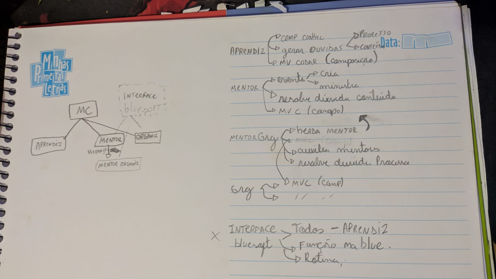

# iniciante-java-oo-2022

Este é o esboço do que tentei modularizar, 1 Classe MovimentoCodar que possui outras 4 inferiores, sendo que 3 delas utilizam composição para aproveitar os atributos da MovimentoCodar. Além disso, também utilizei a herança para criar a classe OrganizadorMentor, que herdará todas características de Mentor, não sendo exclusivamente Organizador.
Para rodar o projeto, basta compilar o arquivo Main.java e ver a sua execução no console.
Neste arquivo de testes, busquei criar exemplos práticos de acordo com o que está escrito no Discord, criando 2 objetos para cada pessoa, um representando informações que todos tem no movimento codar (Nome, stack, papel no movimento codar) e o outro representando os atributos de cada um exclusivo.

Infelizmente sinto que nesse desafio não consegui entregar meu melhor, fiz o desafio utilizando conceitos de composição e herança em sua grande maioria.
Tentei realizar a implementação de interfaces mas não obtive êxito, me dedicarei o dobro para entregar o próximo de forma melhor.

Utilizei a IDE intellij.

## Desafio

O seu desafio será modelar o programa de aprendizes usando seus conhecimentos de programação orientada a objetos. A intenção é abstrair o máximo que conseguir do que acontece no dia a dia durante o programa.

Para relembrar e dar algumas ideias para a sua modelagem, seguem algumas possíveis descrições do que acontece durante o Movimento:

- O programa de aprendizes é composto por aprendizes, mentores e organizadores
  - Mentores também podem ser organizadores

Cada um dos perfis tem características e funções diferentes no Codar, algumas delas são:

- Aprendizes:
  - Aprendem novas habilidades ou evoluem as existentes
  - Compartilham os resultados e experiências adquiridas 
  - Participam de eventos
  - Trazem dúvidas técnicas, de carreira e outras para os mentores
  - Trazem dúvidas de processos e regras para os organizadores;
- Mentores:
  - Criam e ministram eventos
  - Ajudam os aprendizes no processo de aprendizado sanando possíveis dúvidas e compartilhando experiências
  - Criam, revisam e dão possíveis soluções para desafios de cada módulo
- Organizadores:
  - Criam eventos
  - Ajudam mentores e aprendizes com os processos e regras do movimento

## Pré-requisitos

- Instale o [Git](https://git-scm.com/).
- Faça um fork desse projeto clicando no botão `Fork` no canto superior direito da página, conforme a imagem abaixo. 

- Acesse o fork que você criou e faça o clone para a sua máquina. Clique primeiro no botão `Code` e depois copie a URL. 

- Realize o clone com o comando `git clone` + a URL copiada.

- Abra o projeto na sua IDE ou editor de texto preferido. Se não tiver um recomendamos o [IntelliJ IDEA](https://www.jetbrains.com/pt-br/idea/).

## Resolvendo o desafio

Seu desafio é utilizar seus conhecimentos de Java e Orientação a Objetos para modelar o Programa de Aprendizes deste ano. Escrever código faz parte do trabalho de um desenvolvedor, mas mais do que isso devemos pensar em criar soluções para problemas. Seu trabalho será pensar, modelar e escrever código em java para aquilo que tem vivido no dia a dia do movimento em uma solução orientada a objetos, implementada na linguagem de programação Java, pensando em como poderia abstrair tudo isso para um software.

### Avisos

- Crie os arquivos e faça a organização do projeto conforme achar necessário
- Fique à vontade para incrementar o seu modelo como preferir